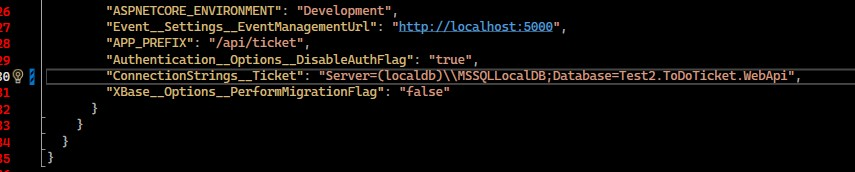
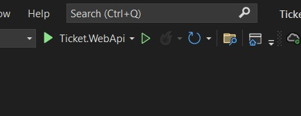

# sleekflow2

+ Clone the project, change the connection string in your launchsetting.json file to your own sql server database

+ 

+ Run the project

+ 

+ Open postman and postman desktop agent
+ Import the following postman collection file

```
ToDoTicket.postman_collection
```

+ Run the postman collection file and modify to test the endpoints
+ For migration, open the package manager console and run the following code

```
EntityFrameworkCore\Add-Migration -Name Test2.ToDoTicket -Context XTicketDbContext -OutputDir Migrations/Ticket
EntityFrameworkCore\Update-Database -Context XTicketDbContext
```

# Endpoints Summary

+ After running the project, you can access the swagger for the endpoints details (including its response and request body) through the following link in your local. You can test the endpoint from swagger as well.

```
https://localhost:6200/api/ticket/swagger/index.html
```

+ /api/Ticket/create : Create to do tasks(ticket) - form inputs that includes ticketSummary, ticketDescription, ticketPriority, ticketStatus, userId, dueDate and attachments
+ /api/Ticket/update : Update to do tasks(ticket) - form inputs that includes ticketId, ticketSummary, ticketDescription, ticketPriority, ticketStatus, userId, dueDate and attachments
+ Attachments input are optional
+ /api/Ticket/filter : Filter to do tasks(ticket) - can filter according to following fields
```
{
  "ticketId": "string",
  "summary": "string",
  "priority": "string",
  "status": "string",
  "assignee": "string",
  "createdStartDateTime": "2023-06-15T22:29:29.262Z",
  "createdEndDateTime": "2023-06-15T22:29:29.262Z",
  "page": 0,
  "pageSize": 0,
  "sortAscFlag": true,
  "sort": "string",
  "quickSearch": "string"
}
```
+ /api/Ticket/details : Retrieve details of to do Tasks - get details of ticket based on Ticket ID (for ex : XT-0001)
+ /api/Ticket/delete : Delete to do tasks(ticket) - delete according to Ticket ID (for ex : XT-0001)
+ /api/Ticket/downloadattachment/{id} : retrieving the attachment uploaded for the ticket based on uuid